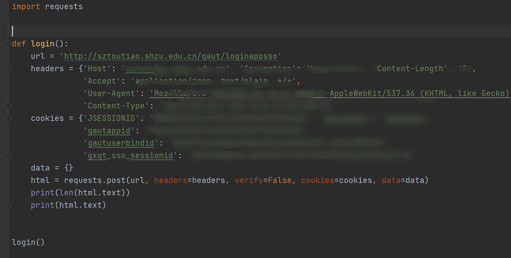

# 石河子大学战疫情自动打卡
## 免责声明
1.为了防止疫情再次扩散，我们一定要如实汇报自己的个人情况，不隐瞒真实状况。

2.但也是为了一定程度减少形式主义，抽出更多的时间去为社会主义建设贡献力量，推荐shzu莘莘学子Star此项目。

3.此申明致敬郑州大学自动打卡项目，respect所有与形式主义做斗争的人们。

## 注：
此版本不赘述抓包并转换成请求内容，如果不会请查看main分支README.MD。

此版本也不包含邮件发送，需要的话可以参考main分支自行添加。

## 使用方法
1.注册华为云（咱们这点调用量是免费的）

2.将之前的login.py，除了import语句，下半部分全选重构提取为方法并命名为"login"(选中后-右键-重构-提取为方法。快捷键ctrl alt m)。完成后应该是长下面这个样子：



3.将之前的sendmsg.py打开，共有三处需要修改：
- 在开头添加上import语句。
```commandline
import datetime   
```
- 在"data = { ... }"下面添加两行。
```commandline
dwtime = datetime.datetime.now().strftime('%Y-%m-%d %H:%M:%S')
data.update({"dwtime": dwtime})  # 更新当日打卡时间
```
- 下半部分全选重构提取为方法并命名为"sendmsg"(选中后-右键-重构-提取为方法。快捷键ctrl alt m)。完成后应该是长下面这个样子：


4.打开华为云，按照图示步骤执行：


10.将修改好的login.py全部复制进去，此处不做截图演示。


14.测试下，右侧日志正常的话即没问题，下面设置触发器。


16.保存即可。

17.sendmsg.py同理进行操作，注意index.py内容应如下：
```commandline
import json
import sendmsg
def handler (event, context):
    sendmsg.sendmsg()
```
18.重点：触发器设置


crontab表达式如下,意思是每天的6点15分执行，可根据需要进行修改。

```commandline
0 15 6 * * ?
```

### 完成

